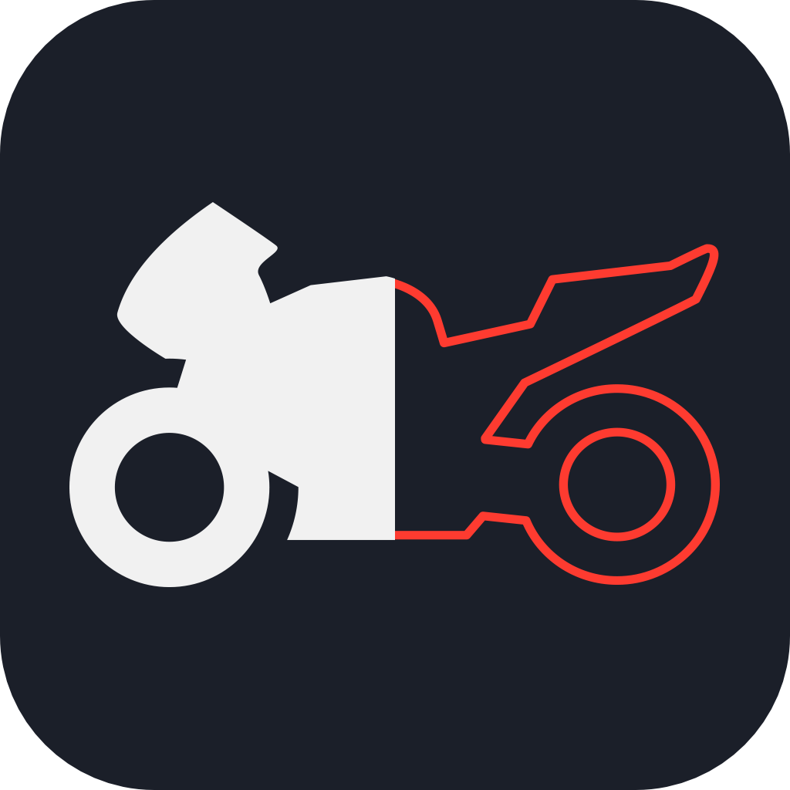
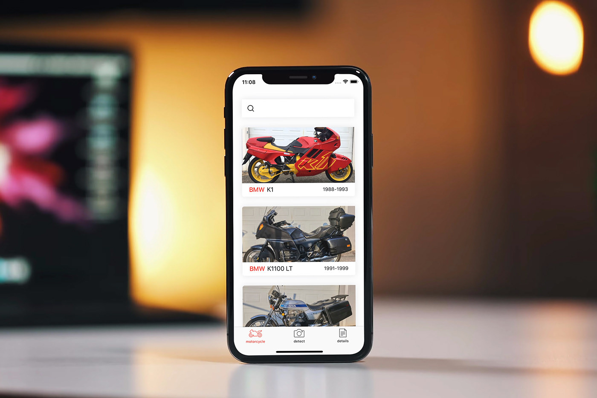
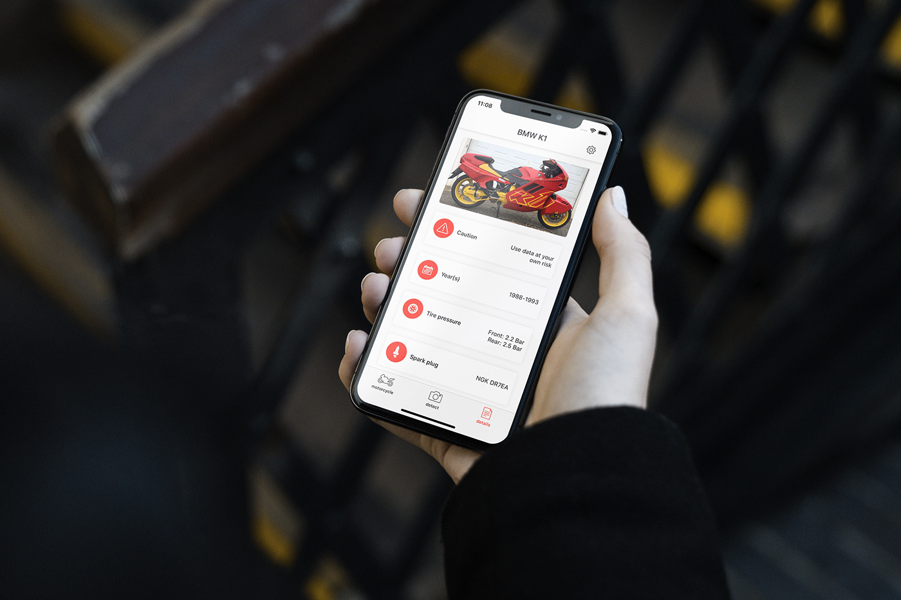
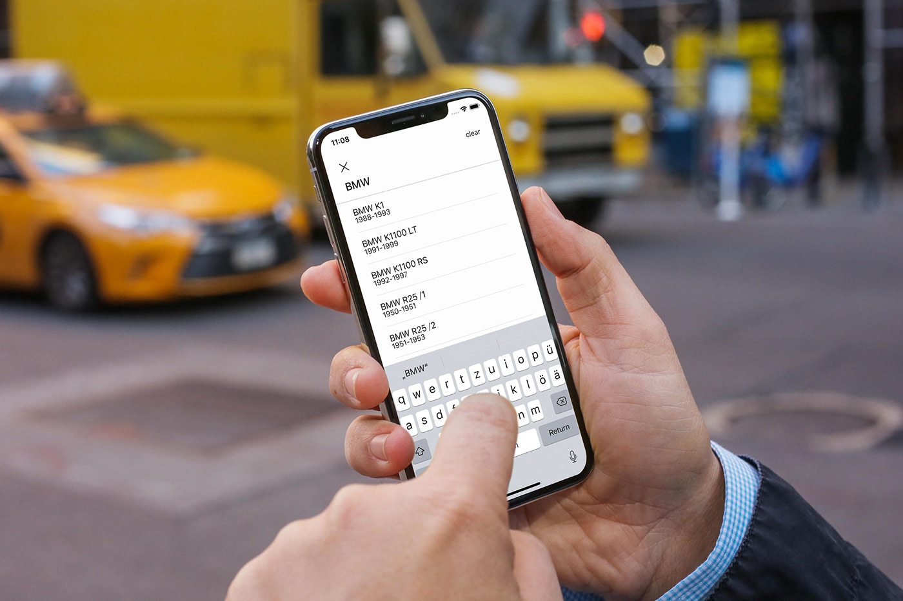

<p align="center">
  
  <h3 align="center">🏍💨 Moto - Motorcycle Specifications at your Fingertips!</h3></br>
  <p align="center">
	<a href="https://gitter.im/moto-iOS/community"></a>
	
	
	<a href="https://developer.apple.com/swift/"></a>
	
  </p>
</p>
<br>

## Live App
Due to the lack of financial support, the app is currently not available on the Apple App Store,

Nevertheless, you can find a live version of the current "release" [HERE](https://appetize.io/app/98xumvjm43fj85fcuv9v7pdhwm?device=iphonex&scale=75&orientation=portrait&osVersion=13.3).

Please keep in mind that this live app runs in an online simulator and thus you cannot access the camera!



## About
Find specifications of your motorcycle quickly and easily, without reading the manual. Just point your phone onto your motorcycle, tap on detect and select your specific model.

Moto uses **Core ML** for high performance, reliable and fast image classification as well as **offline database technology**, such that you can get magnificent motorcycle specifications even when you are out on an adventure!

Please keep in mind that Moto is currently in **Beta** phase and, therefore, the majority of motorcycles displayed are **BMW motorcycles**. The support of all motorcycle brands and models will be implemented in future releases.

At the moment, the motorcycle detection feature only supports the following motorcycle models:  
- BMW K1  
- BMW K1100  
- BMW R25  
- BMW R80  
- BMW R1200  
- BMW S1000  
- HONDA CB400  

**Enjoy the freedom and flexibility of Moto - wherever you are!**

## Development
If you want to build the project on your local machine, use the following instructions.

1. Navigate to the Moto directory
2. run ```pod install```
3. open the ```moto.xcworkspace``` file and start developing 😉

## Todo
- [ ] finish the german translation
- [ ] add more motorcycles to the database
- [ ] add more motorcycles to the ml model
- [ ] add user image upload option

## Limitations
This App is provided as-is!

Please feel free to adapt it to your needs and contribute to the project. I would be very grateful to include your inprovements. Thanks for your support!

**WARNING:** Everyone is responsible for what he/she is doing! I am not responsible if you hurt yourself, torch your house or anything that kind trying to do maintenance work on your motorcycle! You are doing everything at your own risk!
